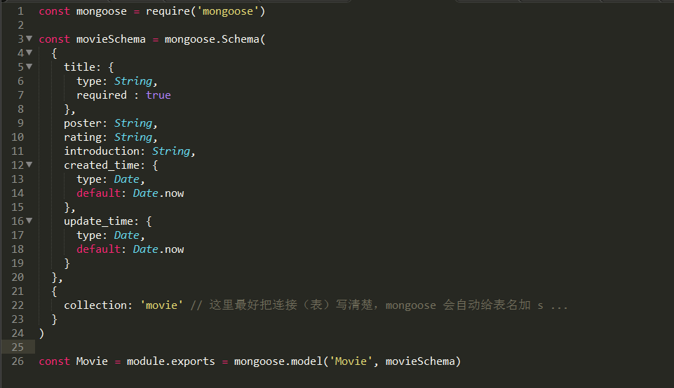
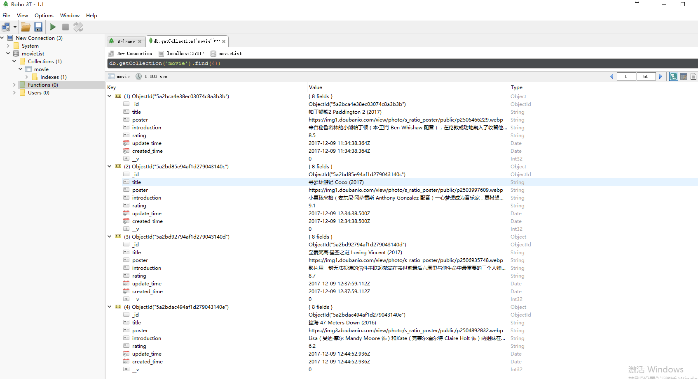

# 一个简单的前后端分离 demo

## 简介
一个前后端分离的 demo ，前端 vue.js 和 materialize ，后端 express 和 mongoose ，数据库 mongodb 。用 express 的提供 api 供前端调用，前端 ajax 请求进行对数据库的 CURD 操作。

## 效果图


## 关键技术点
新建一个 models 目录放数据模型，mongoose 的每个数据 model 需要一个 schema 生成,新建 movie.js 文件或者其他的数据模型，用来提供基础数据。如下图：



接着用 mongoose 链接 mongodb ,在 app.js 里添加

    const mongoose = require('mongoose')
    mongoose.connect('mongodb://localhost:27017/movieList')

链接数据库成功后,可以用 Robomongo 可视化工具或者在 CMD 里输入 mongo 命令查看数据库。

数据库如下图：



然后，通过 [官方文档](http://mongoosejs.com/docs/guide.html) 查一些基本的指令对 model 进行底层的封装，从而把增删改查的接口写好供前端调用。 

## Build Setup

``` bash
# install dependencies
npm install

# serve with hot reload at localhost:8080
npm run dev

# build for production with minification
npm run build

# build for production and view the bundle analyzer report
npm run build --report
```
